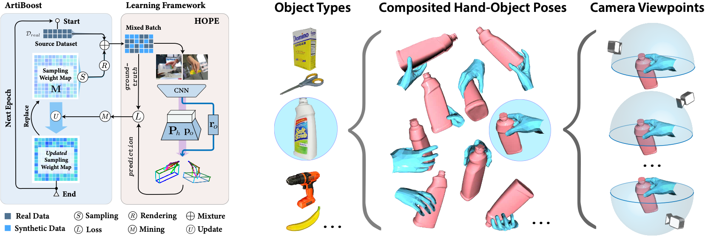
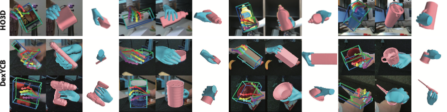

<br />
<p align="center">
    
    <h1 align="center">
        Boosting Articulated 3D Hand-Object Pose Estimation via Online Exploration and Synthesis 
    </h1>

  <p align="center">
    
  </p>
  <p align="center">
    <strong>CVPR, 2022</strong>
    <br />
    <a href="https://lixiny.github.io"><strong>Lixin Yang * </strong></a>
    .
    <a href="https://kailinli.top"><strong>Kailin Li *</strong></a>
    ·
    <a href=""><strong>Xinyu Zhan</strong></a>
    ·
    <a href="https://lyuj1998.github.io"><strong>Jun Lv</strong></a>
    ·
    <a href=""><strong>Wenqiang Xu</strong></a>
    ·
    <a href="https://jeffli.site"><strong>Jiefeng Li</strong></a>
    ·
    <a href="https://mvig.sjtu.edu.cn"><strong>Cewu Lu</strong></a>
    <br />
    \star = equal contribution
  </p>
  
  <p align="center">
    <a href='https://openaccess.thecvf.com/content/CVPR2022/html/Yang_ArtiBoost_Boosting_Articulated_3D_Hand-Object_Pose_Estimation_via_Online_Exploration_CVPR_2022_paper.html'>
      
    </a>
    <a href='https://arxiv.org/abs/2109.05488' style='padding-left: 0.5rem;'>
      
    </a>
    <a href='https://www.youtube.com/watch?v=QbPsjWRyloY' style='padding-left: 0.5rem;'>
      
    </a>
  </p>
</p>

<br />

This repo contains models, train, and test codes.

## TODO

- [x] installation guideline
- [x] testing code and pretrained models
- [ ] generating CCV-space
- [ ] training pipeline

## Installation

<a href="https://pytorch.org/get-started/locally/">
  
</a>
<a href="https://developer.nvidia.com/cuda-11.1.0-download-archive" style='padding-left: 0.1rem;'>
  
</a>
<a href="https://releases.ubuntu.com/20.04/" style='padding-left: 0.1rem;'>
  
</a>

Following the [Installation Instruction](docs/Installation.md) to setup environment, assets, datasets.

## Evaluation

### HO3Dv2, Heatmap-based model, ArtiBoost

Download checkpoint: [pretrained](https://drive.google.com/file/d/1AEZdR46FslwRWrm0NYUh9h6riO1XwXhO/view?usp=sharing) (`artiboost_ho3dv2_clasbased_100e.pth.tar`) to `./checkpoints`.  
Then run:

```shell
$ python train/submit_reload.py --cfg config_eval/eval_ho3dv2_clasbased_artiboost.yaml \
  --gpu_id 0 --submit_dump --filter_unseen_obj_idxs 11 --batch_size 100
```

This script yield the (Our _Clas_ + **Arti**) result in main paper Table 2.

- The object's MPCPE socre is stored in `exp/submit_{cfg}_{time}/evaluations/`.
- The HO3Dv2 Codalab submission file will be dumped at: `./exp/submit_{cfg}_{time}/{cfg}_SUBMIT.zip`.  
  Upload it to the [HO3Dv2 Codalab](https://codalab.lisn.upsaclay.fr/competitions/4318) server and wait for the evaluation to finish.

You can also **visualize the prediction** as the images below:

<p align="center">
  
</p>

First, you need install extra packages for rendering. Use `pip` to sequentially install:

```
vtk==9.0.1 PyQt5==5.15.4 PyQt5-Qt5==5.15.2 PyQt5-sip==12.8.1 mayavi==4.7.2
```

Second, you need to connect a display window (could be a display monitor, TeamViewer, or VNC server) that supports Qt platform plugin "xcb".  
Inside the display window, start a new terminal session and append: `--postprocess_fit_mesh` and `--postprocess_draw` at the end of the shell command,
e.g.

```sh
# HO3Dv2, Heatmap-based model, ArtiBoost
$ python train/submit_reload.py --cfg config_eval/eval_ho3dv2_clasbased_artiboost.yaml \
  --gpu_id 0 --submit_dump --filter_unseen_obj_idxs 11 --batch_size 100 \
  --postprocess_fit_mesh --postprocess_draw
```

The rendered qualitative results are stored at `exp/submit_{cfg}_{time}/rendered_image/`

### HO3Dv2, Regression-based model, ArtiBoost.

[pretrained](https://drive.google.com/file/d/1RmbQ3jEkvK9yaa-MFVwrAxtzJYqjxMx5/view?usp=sharing) (`artiboost_ho3dv2_regbased_100e.pth.tar`)

```shell
$ python train/submit_reload.py --cfg config_eval/eval_ho3dv2_regbased_artiboost.yaml \
  --gpu_id 0 --submit_dump --filter_unseen_obj_idxs 11
```

This script yield the (Our _Reg_ + **Arti**) result in main paper Table 2.

### HO3Dv3, Heatmap-based model, ArtiBoost

[pretrained](https://drive.google.com/file/d/1PGTPki_AYtcJaHog_1EELvJHZJPY8VSn/view?usp=sharing) (`artiboost_ho3dv3_clasbased_200e.pth.tar`)

```shell
$ python train/submit_reload.py --cfg config_eval/eval_ho3dv3_clasbased_artiboost.yaml \
  --gpu_id 0 --submit_dump --filter_unseen_obj_idxs 11
```

This script yield the (Our _Clas_ + **Arti**) result in main paper Table 5.  
Upload HO3Dv3 Codalab submission file to the [HO3Dv3 codalab](https://codalab.lisn.upsaclay.fr/competitions/4393) server and wait for the evaluation to finish.

### HO3Dv3, Heatmap-based, Object symmetry model, ArtiBoost

[pretrained](https://drive.google.com/file/d/1lCU2hemolkJ7Z7armyYHvJv-yEiQKxYz/view?usp=sharing) (`artiboost_ho3dv3_clasbased_sym_200e.pth.tar`)

```shell
$ python train/submit_reload.py --cfg config_eval/eval_ho3dv3_clasbased_sym_artiboost.yaml \
  --gpu_id 0 --submit_dump --filter_unseen_obj_idxs 11
```

This script yield the (Ours _Clas_ sym + **Arti**) result in main paper Table 5.

### DexYCB, Heatmap-based, Object symmetry model, ArtiBoost

[pretrained](https://drive.google.com/file/d/1i49UVkWQtXoaRHjV3JtHQ_l1nO6vMx89/view?usp=share_link) (`artiboost_dexycb_clasbased_sym_100e.pth.tar`)

```shell
$ python train/submit_reload.py --cfg config_eval/eval_dexycb_clasbased_sym_artiboost.yaml --gpu_id 0
```

This script yield the (Ours _Clas_ sym + **Arti**) result in main paper Table 4.

## Generate CCV

## Training Pipeline

## Acknowledge & Citation

```
@inproceedings{yang2021ArtiBoost,
    title={{ArtiBoost}: Boosting Articulated 3D Hand-Object Pose Estimation via Online Exploration and Synthesis},
    author={Yang, Lixin and Li, Kailin and Zhan, Xinyu and Lv, Jun and Xu, Wenqiang and Li, Jiefeng and Lu, Cewu},
    booktitle={IEEE/CVF Conference on Computer Vision and Pattern Recognition (CVPR)},
    year={2022}
}
```
